# Human led EVM audit harness proposal

Status: **proposed design**, 2026-10-01. Author: **Codex**. [DEC-002](../decisions/DEC-002-harness-operating-envelope.md) accepts Solidity/EVM first, small auditor-approved investigation batches, and a local workspace with approved cloud AI providers. [DEC-004](../decisions/DEC-004-confirmation-evidence-policy.md) accepts justified alternative evidence for confirmation. Other architectural choices below are recommendations for review. [DEC-001](../decisions/DEC-001-knowledge-and-memory.md) continues to govern the design lab's separate memory.

Build a persistent audit workspace in which one human auditor directs agents toward precise security questions, checks their evidence, and decides what becomes a finding. Organize work around protocol guarantees and value flows. Use hypotheses, property campaigns, and adversarial scenarios as three investigation methods over the same records and execution controls.

The proposed product is an **evidence workbench**: it should make the next useful audit decision easier, preserve why a lead was accepted or rejected, and identify which conclusions need revisiting after a change. Its value is a hypothesis to evaluate, not an established improvement in vulnerability detection.

## Reading guide

| Document | What it specifies |
|---|---|
| This proposal | Product, architecture, roles, auditor workflow, and delivery boundary |
| [State and execution](harness-state-and-execution.md) | Records, transitions, permissions, isolation, recovery, memory, and invalidation |
| [Component and artifact contracts](harness-interface-contracts.md) | Requests, errors, adapter boundaries, reconciliation, export and import behavior |
| [Auditor guide](harness-auditor-guide.md) | Intake through closure, decision packets, exceptions, interruption and interface states |
| [Requirements](harness-requirements.md) | Functional and non-functional requirements with observable acceptance scenarios |
| [Evaluation](harness-evaluation.md) | Evidence quality, pilot design, metrics, and controlled improvement |
| [Research and rationale](../research/harness-design-sprint.md) | All imported diagrams, selected primary-source checks, new research, alternatives, and limits |
| [Design dispositions](../decisions/DEC-003-harness-architecture-proposal.md) | What is proposed, why, alternatives, and unresolved choices |
| [Specification completion audit](../research/harness-specification-completeness.md) | Requirement-by-requirement evidence and the boundary between completed documentation and future runtime checks |

## Product boundary

The primary user is one experienced smart contract auditor who owns the engagement's scope, threat model, semantic judgments, findings, and closure. Protocol developers may supply answers and patches through that auditor. A second human review can be recorded when available; several agents do not substitute for one.

Inputs are pinned source and dependencies, intended behavior, deployment/configuration facts, known issues, prior reports, allowed attacker capabilities, time and spending limits, and disclosure constraints. Outputs are confirmation reports, reproducible PoC packages where appropriate, rejected leads with reasons, unresolved concerns, reviewed properties, and revision-specific fix assessments.

Version one covers Solidity source on explicitly identified EVM chains and hardfork semantics. A source-only audit is supported when deployment information is unavailable; its report must state that boundary. Compiler, build-system, proxy, library, assembly, token, oracle, and chain-specific support are checked per engagement. Unsupported behavior becomes a gap. Future ecosystem adapters must supply their own semantic and evidence contracts.

The harness assists manual comprehension, analysis, testing, and reporting. Model training, training-data preparation, live exploitation, production transactions, autonomous final adjudication, and automatic patch merging are outside the initial product. Remediation work means evaluating a separately supplied patch and optionally drafting recommendations.

## Proposed architecture

[Editable diagram source](diagrams/harness-architecture.mmd). Arrows show permitted information paths, not unrestricted file or network access. Components may begin as modules in a local application; the diagram does not require a service fleet.

| Component | Responsibility and boundary |
|---|---|
| Auditor interface | Persistent notebook, system model, investigation queue, evidence comparison, decisions, and export preview; supports pause, redirect, and resume |
| Controller | Sole authority for metadata writes, scheduling, resource reservations, capability grants, decision validation, and state transitions; ordinary program logic, not an LLM agent |
| Engagement store | Versioned semantic records, job/event history, human decisions, dependencies, and report manifests; transactionally consistent metadata |
| Evidence archive | Immutable source snapshots, manifests, logs, traces, fixtures, minimized cases, and replay receipts, addressed by content hash |
| Context builder | Makes a bounded, versioned packet for each role; includes relevant contradictions and unknowns and records retrieved sources |
| Agent workers | Propose analysis, tasks, experiments, model edits, and report prose inside a capability-limited context; cannot approve themselves |
| Tool broker and execution workers | Run pinned analyzers and experiments in isolated workspaces; return result receipts and artifacts; no direct mutation of canonical conclusions |
| Provider broker | Holds provider credentials outside workers; sends only approved context through a selected provider policy and accounts for usage |
| Change evaluator | Traverses dependencies after source, configuration, premise, property, or tool-model changes; marks applicability stale and builds a review queue |
| Report and evaluation module | Exports a frozen set of decisions and evidence; measures workload and gaps using a recorded metric version |

**Initial substrate recommendation:** local controller, transactional metadata such as SQLite, content-addressed files, and an existing agent interface connected through a narrow API. A small local runner and LangGraph are candidates for the job layer; Temporal is a later option if remote durable execution merits its operational cost. The selection remains open until the [recovery scenarios](harness-evaluation.md#control-and-recovery-scenarios) are exercised. Workflow checkpoints cannot be the only authority for audit decisions.

**Initial tool recommendation:** use the target's pinned compiler/build configuration, Slither for structural queries and candidate signals, and Foundry/Anvil for local experiments and replay. Check interfaces and supported versions before integration. Add Echidna, Medusa, Halmos, or a formal verifier when a selected question warrants it. Vendor scanners enter as attributed candidate sources with exportable raw results, not as independent adjudicators. These are documented capability precedents, not integrations validated by this sprint. [Primary-source register](../kb/sources.md#sprint-primary-sources).

Use a curated control checklist as an omission review alongside protocol-specific guarantees. For each relevant control, record applicability, examined evidence, exclusions and outstanding gaps. OWASP supplies linked verification and testing resources, but checking off controls does not establish whole-protocol security. [OWASP SCSVS](https://scs.owasp.org/SCSVS/).

## Agent role classification

Roles are reusable task profiles with different context and tool grants. They need not be different models or always-on processes. Start with the few roles needed for the current batch; compare their contribution before increasing concurrency.

| Role | Receives | Produces | May not decide |
|---|---|---|---|
| Intake and comprehension agent | Snapshot, documents, structural queries | Assets, actors, states, flow maps, intent/implementation differences, unresolved premises | That developer intent or its own summary is correct |
| Planning assistant | Current model, coverage gaps, unresolved leads, remaining budget | Ranked questions and a proposed batch, including a less-explored area | Scope expansion, new permissions, or the batch budget |
| Investigator | One question, permitted attacker model, local code and relevant evidence | Causal claim, counterconditions, trace, and cheapest useful next check | Finding validity, final severity, or dismissal of competing evidence |
| Property and experiment agent | Selected question and reviewed semantics | Versioned fixtures, handlers, reference models, test artifacts and adequacy notes | A changed oracle, narrower attack model, or edited production target |
| Challenger | Same authoritative snapshot and premises; initially no author's narrative | Independent prerequisite check, counterargument, missing evidence; then artifact review | Majority-vote truth or human acceptance |
| Synthesis and reporting agent | Frozen outputs and disposition records | Duplicate proposals, cause chains, concise review packets, draft report text | Silent deletion/merging of leads, new findings in final prose, or report release |
| Knowledge curator | Engagement-local reviewed and provisional lessons | Source-linked patterns, counterconditions, retrieval corrections | Cross-engagement sharing, policy changes, or turning a memory into a finding |

The reproduction runner is a deterministic tool role: it runs a reviewed package in a fresh environment and records the outcome. An agent can prepare or explain that package but cannot manufacture its execution receipt.

An initial discovery pass can withhold sibling hypotheses and historical finding text to reduce anchoring. The challenger first receives the claim and source anchors without the originating rationale, then inspects the actual fixture and evidence. Both passes retain their context manifests. Shared training data and premises still limit independence; agreement is not additional proof.

## Audit stages and human touchpoints

| Stage | Work performed | Human decision and exit artifact |
|---|---|---|
| 1. Engagement intake | Freeze code/environment; inventory dependencies; attempt an isolated baseline build; list missing information | Accept scope, allowed capabilities, processing policy, and budget; record acknowledged gaps |
| 2. Progressive comprehension | Explain purpose, state ownership, complete value flows, critical paths, permissions, and dependencies; compare intent with implementation | Correct key guarantees and assumptions for the first audit units; retain unresolved or contested semantics |
| 3. Investigation selection | Convert discrepancies, manual notes, tool signals, and coverage gaps into precise questions | Approve a small batch with questions, methods, budget, and interrupt conditions |
| 4. Bounded execution | Investigate, trace, draft experiments, run permitted tools, challenge premises, package results | Interrupt only for changed scope/meaning/permissions, a material blocker, or an urgent credible concern; approve property semantics when needed |
| 5. Evidence and disposition | Clean replay, realism review, duplicate/cause analysis, severity assessment | Accept, reject, dispute, defer, or request more work with a reason; preserve proof status separately |
| 6. Fix review | Pin a new revision, reopen affected conclusions, rerun witnesses and legitimate paths, inspect related changes | Assess fixed, partly fixed, not fixed, or not assessed for that revision |
| 7. Closure and learning | Review gaps and unresolved exposure; prepare reports and packages; capture scoped lessons | Approve the report snapshot and its intended audience; close or explicitly stop incomplete |

These stages can overlap across audit units. An uncertain oracle assumption should block only conclusions that require it; unrelated authorization work can continue. A new finding can reopen the model or a prior batch. The auditor may skip a method with a recorded reason; skipping is visible as a coverage limitation.

Comprehension ends when the auditor can use the model to select useful investigations for a unit, not when every function has a generated explanation. The system must still register all scoped units and unresolved boundaries so that selective depth does not look like complete review.

## Interaction and question design

The auditor's home view shows three things first: decisions needed, current work and spending, and material gaps. Each investigation has a short review packet: question, affected guarantee/flow, attacker prerequisites, strongest supporting and refuting evidence, missing information, recommended next step, and estimated effort. Code and full logs are one step away.

A clarification asks for one decision in domain language. It cites the contradictory facts, explains what changes with each answer, offers a recommendation when justified, and permits “unknown.” It also names the affected work and the human owner. Agents first look for an answer in the approved records; they do not ask the auditor to resolve formatting, duplicate filenames, tool retries, or facts directly established by available code.

Examples of consequential questions:

- “Are tokens that charge a transfer fee supported? If yes, deposits must account for assets actually received. If unknown, this accounting conclusion stays conditional.”
- “May a user control this callback recipient? The current PoC requires that capability; otherwise it is only a stress test.”
- “Is an emergency pause allowed to delay withdrawals beyond the settlement window? This determines whether the demonstrated lockup violates the promised behavior.”

An operator answer about intended behavior is recorded as intent or an explicit assumption; it does not overwrite observed code behavior. If the code contradicts the answer, preserve the conflict. If the intended design itself exposes an important risk, open a design-risk question rather than labeling the behavior safe by definition.

**Proposed starting limits:** three active investigations per batch, at most two concurrent agent workers and one heavy experiment, and no autonomous child spawning. These are tunable pilot settings. A worker can request a child task; the controller admits it only within the approved question, permissions, depth, and remaining budget. With child limit zero it returns to the planner. An urgent lead can interrupt a batch, but cannot authorize external action or extra spend.

When the review queue reaches the approved capacity, pause new discovery and finish or checkpoint admitted work. Offer the auditor a brief reconciliation packet. Time waiting for the auditor is tracked separately from active human work; silence does not accept a proposal. No minimum finding quota is used.

## Three investigation methods

**Hypothesis investigation:** begin with a falsifiable failure claim, establish the full relevant path, identify the strongest countercondition, and perform a check that distinguishes the alternatives. A rejection cites the guard, reachability constraint, or intended behavior that defeats this specific claim and its revision.

**Property campaign:** derive the guarantee from reviewed intent; specify actors, units, quantification, actions, bounds, environmental assumptions, and an independent oracle. Review reachable-state witnesses and a relevant adequacy challenge before counting a campaign as useful evidence. A counterexample can reveal a target defect, a bad specification, or a faulty fixture. These are separate outcomes.

**Adversarial scenario:** test a complete causal sequence across a selected value flow and its dependencies. Account for all controlled addresses, capital introduced, loans repaid, fees, residual positions, final settlement, and victim impact. Nonprofit impacts such as lockup remain valid questions. Mocks and impossible privileges are labeled stress assumptions and cannot silently support a deployment claim.

All three methods use the [same investigation and evidence records](harness-state-and-execution.md#record-contracts). The chosen method changes the experiment, not who can accept the conclusion.

## Confirmation reports and PoC packages

Each confirmation report contains the causal mechanism, affected code and deployment scope, broken guarantee, realistic prerequisites, supporting and refuting evidence, impact, human-assigned severity and its rubric, evidence limitations, remediation recommendation, fix status if assessed, and decision references. An executable confirmation includes a clean replay receipt. Under DEC-004, the auditor may explicitly accept alternative evidence when a runnable PoC is impractical, documenting the justification and limits. The exception cannot turn an unreviewed narrative into a confirmation.

A PoC package includes the unmodified target identity, separately versioned test/fixture files, dependency and tool manifests, a reproducible command with secret placeholders, expected observation and actual trace, setup powers and assumptions, fork identity when used, and integrity hashes. An expected successful PoC test may assert that a violation occurs; the runner distinguishes assertion meaning from the process exit code. A random crash or compilation failure is not exploit evidence.

The overall report includes scope, methods, important guarantees with review status, accepted findings, unresolved concerns and excluded work, tool failures and limitations, and revision-specific fix assessments. It makes no claim of universal security or exhaustive vulnerability discovery. The export is generated from a frozen decision/evidence snapshot; later changes produce a new version, never a silent rewrite.

## Proposed delivery sequence

1. Specify and later trial the core: intake, isolated execution, durable jobs, manual investigations, human decisions, one replay package, and change invalidation. The current repository delivers these specifications only.
2. Add role-specific agent assistance, batch scheduling, question routing, rejection retention, report export, and workload accounting. Complete control/recovery checks before accepting audit conclusions through it.
3. Exercise a small property campaign and an integration scenario using the same records. Add a specialist engine only when needed and record the value of that addition.
4. Compare against the auditor's ordinary workflow using the [evaluation plan](harness-evaluation.md). Adjust prompts, retrieval, roles, and tools through versioned changes with a rollback path.

The first proposed adoption milestone is a complete, replayable, resumable investigation under human authority, including a refuted lead and a changed-premise exercise. A full audit requires the wider coverage and closure contract. Acceptance of this architecture remains a separate operator decision in [DEC-003](../decisions/DEC-003-harness-architecture-proposal.md).
