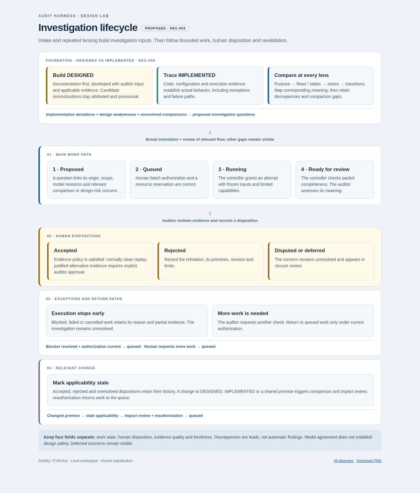
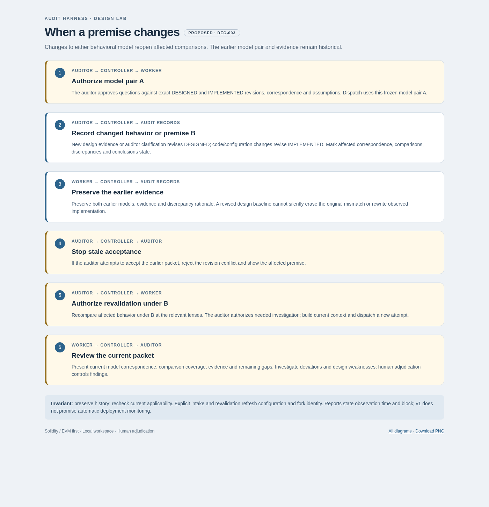

# Harness state and execution specification

Status: **proposed**, 2026-10-01. Companion to the [product proposal](audit-harness.md). Requirements here describe a future implementation; no harness runtime is provided in this lab.

The controller owns the audit record. Agents submit proposals and tool requests; they do not edit accepted conclusions, decision records, or the target snapshot. Historical evidence stays immutable, while its applicability to the active revision can change.

The [component and artifact contracts](harness-interface-contracts.md) define how these rules appear at requests, adapter boundaries, errors and portable exports. The [auditor guide](harness-auditor-guide.md) describes the corresponding human workflow.

## Record contracts

Every record has a stable engagement-scoped ID, type, schema version, revision, creation actor/time, originating job or human action, visibility, and explicit dependency references. References identify an exact revision or artifact hash. Display names and line numbers alone are insufficient identity. Unknown values are explicit with a reason; they do not become invented defaults.

| Record | Required content beyond common metadata |
|---|---|
| Engagement | Owner; audit purpose; ecosystem/chain; scope/exclusions; target and dependency identities; threat model; data policy; severity rubric; budget; evidence policy; closure status |
| Target snapshot | Commit when available plus content hashes; dirty/untracked included files; dependencies/remappings; effective compiler, optimizer and EVM settings; build receipt; deployed addresses, proxy implementations and configuration if claimed; fork chain/block number/hash and source retrieval provenance |
| System statement | Kind: intent, observed implementation, assumption, guarantee, or unknown; statement; source anchors; applicability; supporting/contradicting evidence; review status and owner |
| Behavioral correspondence | Exact DESIGNED/IMPLEMENTED statement revisions or explicit missing side; audit unit/lens; one-to-many mapping; conditions, assumptions and abstraction limits; mapping evidence and review status |
| Behavioral comparison | Correspondence revisions; examined behavior and bounds; coverage: missing-design, unexamined-implementation, partial, or examined; result: unresolved, discrepancy, or no-discrepancy-observed; supporting/refuting evidence; uncertainty; owner and next action |
| Behavioral discrepancy | Comparison and claim revisions; deviation or unmatched behavior; triggering conditions; evidence support and uncertainty; proposed distinguishing check; linked questions/investigations; human disposition and freshness separately |
| Audit unit | Complete flow, guarantee, boundary, or component; entry points and state writers; dependencies; risk rationale; planned methods; review status; evidence and explicit gaps |
| Question | One unresolved issue; conflicting facts; answer source sought; options and consequences; recommendation; owner; dependency blockers; status and next action |
| Batch authorization | Human decision; exact scope/model revisions; admitted questions/methods; worker/tool capabilities; egress policy; spending/runtime/concurrency/child limits; expiry, cancellation and interrupt conditions |
| Investigation | Method; falsifiable claim or question; origin; audit units/guarantees; attacker capabilities; prerequisites; source anchors; supporting/refuting evidence; next check; job links; work state; human disposition; potential impact and proof status separately |
| Property or scenario | Intended behavior source; actors/actions; units and bounds; environmental assumptions; oracle or impact calculation; excluded actions with reasons; fixture revision; semantic review; adequacy evidence |
| Job and attempt | Authorization and context IDs; role; input hashes; tool/model identifiers and settings; capability grants; reserved and actual resources; attempt ID; lease/heartbeat; command or request manifest; execution status; result receipt |
| Evidence artifact | Content hash; producer and receipt; target/fixture/property/environment revisions; command arguments and working directory; tool version; exit status; structured result; raw output/traces; seed/corpus if relevant; start/end time; missing/truncated data; limitations |
| Human decision | Human actor authenticated through the auditor interface; action; reviewed revisions/dependency digest; disposition; rationale; severity basis when applicable; time; superseded decision if any |
| Finding and fix assessment | Linked accepted investigation; mechanism/prerequisites/impact; evidence class; acceptance decision; applicability; separately versioned fix commit, evidence, assessment and residual issues |
| Report manifest | Exact included record/artifact revisions; report hash; gaps/unresolved items; audience/redaction policy; human approval; export receipt |

The context manifest records prompt/template revisions, selected memories and documents, prior outputs intentionally withheld, model/provider identifiers actually returned, and relevant configuration. Record compact reasons and tool-visible work, not a requirement to expose a model's private reasoning. If a provider cannot expose immutable model identity, record that limitation rather than promising identical future generation.

DESIGNED and IMPLEMENTED are separately inspectable views over attributed system statements, not replacements for the existing statement kinds. Statements identify their model affiliation and origin (documented claim, auditor clarification, inferred candidate, adopted assumption, source analysis or execution observation). Shared assumptions may support both with explicit dependencies. Comparison and discrepancy records follow the same write, human-approval, retrieval and invalidation rules as other semantic records; agents may submit provisional records, but cannot approve consequential semantics. Both model revisions and correspondence limits must survive context construction and export.

## Shared knowledge and memory

Maintain four distinct surfaces:

1. **Raw evidence:** immutable inputs and outputs, never overwritten by summaries.
2. **Engagement knowledge:** versioned intent, implementation, assumptions, guarantees, hypotheses, and decisions. A contradiction can exist without forcing a single merged narrative.
3. **Working context:** a role-specific snapshot plus a record of what the agent actually retrieved. Semantic claims carry their status and limits into the packet.
4. **Reusable lessons:** source-linked patterns and counterconditions with applicability and review state. These guide investigation and have no approval authority.

Use keyword retrieval over IDs, symbols, flows, and mechanisms initially. Retrieve a negative example or contradiction together with the claim it qualifies. A later semantic index is a replaceable derived view and must respect engagement boundaries. Missing source anchors quarantine a lesson from consequential use.

This operational store is separate from the lab's `memory/plur/`. DEC-001 does not make PLUR the harness's authoritative evidence store. PLUR could supply a per-engagement recall adapter after schema, isolation, provenance, and host behavior are validated; that is a proposed reuse path. It cannot own finding acceptance or replace evidence. Automatic capture may create attributed provisional lessons, but does not promote them into decisions.

No automatic copying between engagements, personal stores, or the design lab. Any reusable export requires an auditor-selected destination, sensitivity review, and an explicit export record. Plain “private” metadata is not access control. Changes to a lesson preserve the prior version and invalidate affected derived recommendations where relevant.

## Write and approval protocol

Only the controller opens writable canonical metadata. Workers receive read snapshots and private scratch/output directories. They submit typed proposals including the base revision. The controller validates the schema, source anchors, grant, engagement identity, and expected revision before committing a record update and event atomically.

On revision conflict, retain both proposals and request rebase or human reconciliation; never silently use last-write-wins for semantic claims. Duplicate artifact submissions with the same attempt and content hash are idempotent. Root-cause clustering retains each origin and dissent; final consolidation is reviewable and reversible.

Human-only actions use an authenticated interface inaccessible to worker processes. A structured tool result containing “approved” cannot become a decision. At commit time, the controller compares the exact records and dependency revisions the auditor reviewed with current eligible state. If any material dependency changed, reject the stale approval, show the difference, and request review again. A user click does not grant unbounded authority to later content.

Stage evidence by hashing and durably storing artifacts before making them eligible through a metadata transaction. Incomplete uploads have no eligibility. If the metadata commit fails, the unreferenced blob may be retained for later recovery; it is not a finding. Evidence receipts identify the trusted runner separately from worker-authored interpretations. Hashes detect changes; they do not prove semantic truth or defeat a compromised host administrator.

The tool broker and receipt collector run outside both the agent sandbox and the sandbox executing target code. Neither sandbox can write their executable, grant configuration, receipt channel or canonical store. The collector records the launched command/image identity, observed process outcome and output hashes through the supervisor; guest-written metadata is retained as untrusted output. This establishes provenance of execution, not the truth of the test's assertion or the completeness of its instrumentation.

## State transitions

Use separate fields for work state, disposition, evidence quality, and freshness. Combining these into one “verified” label conceals important distinctions.

[Open the HTML diagram](diagrams/investigation-lifecycle.html).

| From and trigger | Result | Authority and guard |
|---|---|---|
| New question | `proposed` | Agent or human may submit it; question, origin, and scope must be explicit |
| Proposed work admitted | `queued` | Controller requires current human batch authorization and resource reservation |
| Queued job starts | `running` | Valid grant and attempt lease; exact input/context revisions frozen |
| Running job needs a premise or cannot complete | `blocked`, `failed`, or `cancelled` job; investigation stays unresolved | Controller records a reason and partial evidence; none means “refuted” |
| Worker submits complete packet | `ready_for_review` | Controller checks required records/receipts, not semantic truth; packet may explicitly report insufficient evidence |
| Auditor requests another check | `queued` under a current authorization | Changed scope, property meaning, or permissions require an updated decision |
| Auditor adjudicates | Disposition `accepted`, `rejected`, `disputed`, or `deferred` | Human decision with rationale and current dependency digest; `accepted` additionally satisfies evidence policy |
| Relevant premise changes | Freshness `stale`; dependent work/decisions listed for review | Controller invalidation; historical disposition preserved |
| Revalidation completed | New current applicability/decision record | Controller links new evidence; human reaffirms consequential conclusions |

Work can be administratively `closed` after a human disposition or cancellation. Deferred/disputed items remain unresolved and appear in closure review. Reopening creates a new work revision and preserves the earlier closure. A batch is `completed` only when every admitted job is terminal or explicitly skipped/cancelled with a reason; completed execution is not completed audit coverage.

Evidence quality is recorded through independent fields: provenance complete/incomplete, prerequisite review pending/accepted/disputed, adequacy pending/sufficient/insufficient/not-applicable with reason, and replay not-required/pending/succeeded/failed/unavailable. A tool's result is separately one of `counterexample`, `no_violation_observed`, `proved_in_model`, `inconclusive`, `unsupported`, or `error`, with bounds and mode. Formal results do not erase model assumptions. No numeric LLM confidence authorizes acceptance.

## Permissions and isolation

The threat model includes hostile repository files and build scripts, malicious retrieved material, misleading tool output, compromised agent behavior, accidental cross-engagement retrieval, and fixtures that silently alter the target. Trust the local operator and controller host as the initial administrative boundary; a compromised host remains outside the claimed isolation guarantee.

| Capability | Proposed enforcement |
|---|---|
| Read code and documents | Mount only the selected snapshot/context; do not expose other engagements, home directories, SSH agents, or secrets |
| Compile, analyze, and test | Disposable process/container/VM boundary chosen after compatibility checks; fixed tool images; unprivileged execution; CPU, memory, disk, time, process-count and output limits |
| Write experiment files | Per-job scratch overlay; original target read-only; classify and inspect fixture differences before evidence acceptance |
| Install dependencies | Separate preparation action under an approved source/package policy, with pinned results; no repository-provided agent/tool configuration auto-execution |
| Call cloud AI | Dedicated provider broker outside execution workers; approved provider, data classes, context limits and purpose; no raw provider keys in worker environments |
| Fetch public references | Brokered allowlisted retrieval; no private code pasted into public search queries; provenance and content treated as untrusted data |
| Read chain state | Approved archive endpoints through a method/parameter allowlist; explicit chain/block binding; no signer or live transaction broadcast |
| Mutate chain state for a test | Ephemeral local fork only; local endpoint namespace distinct from upstream; bind/listen only inside the isolated environment |
| Approve or export | Authenticated auditor endpoint; scoped report audience/destination and preview; unavailable to agent workers |

MCP may carry requests but supplies neither these permissions nor sandbox isolation. Shell requests use structured arguments and validated paths; path traversal, symlink escapes, archive extraction and executable report content are checked at ingestion. Disable unrestricted FFI and inherited tool configuration; allow a needed exception only through a capability change. Output displayed in reports is escaped and cannot run scripts or issue commands.

Upstream RPC access must enforce allowed read methods and bounded requests, not merely allow a hostname; redirects and alternate endpoints cannot bypass policy. Local test funding and impersonation are permitted fixture operations, but their use is logged and reviewed against attacker realism. Allowed inference egress is likewise limited by approved engagement data classes and context construction, not merely a provider domain. Credentials used by brokers have scoped roles and stay out of logs/exported manifests.

Each engagement chooses retention and backup policy at intake. Back up metadata, artifacts, tool manifests and decisions together through a consistent snapshot, including required journal state. Restore into an isolated location and verify references/hashes before resuming. A corrupt store stops writes and preserves the damaged material; deleting it and restarting is not recovery. Expired material is removed only through the recorded retention workflow, with dependent records marked unavailable and no claim that deleted evidence remains replayable.

## Durable jobs and resource limits

A logical job has immutable input identity and one or more attempts. The controller reserves the maximum permitted model/compute/runtime allocation before dispatch, issues an attempt lease and limited capability, and persists the dispatch intent. A runner reports heartbeat, progress, receipt, and output identity. Completion commits once for that attempt; duplicate receipts do not create new findings or charges in accounting.

If the controller restarts, reconcile dispatch intent with runner receipts before retrying. If a worker lease expires, fence its later writes and revoke capabilities; preserve late output as historical material pending reconciliation. Stop the worker or establish that it has terminated before admitting a replacement that could exceed concurrency/resource limits. A pause or cancellation stops new dispatch, revokes grants as appropriate, terminates process descendants, and retains partial artifacts. Resumption validates scope, policy, and input freshness again.

Tool jobs may retry transient transport/startup failures inside the authorized retry budget. A reproducible compiler failure should generate a diagnosis, not an unbounded retry. Test repair is limited to the generated fixture and retains every diff. Changing assertion meaning, input domains, attacker powers, mocks, or source logic requires new semantic review. Suggested initial repair limit: two attempts, a pilot parameter.

Cloud request timeouts may leave cost/outcome uncertain if the provider offers no idempotency or retrieval API. Record `outcome_unknown`, preserve the reservation, and reconcile if possible; any allowed replacement consumes another conservative reservation. A local ledger cannot guarantee exactly-once provider billing. Never silently retry beyond the cap. Report estimated, confirmed and uncertain spending separately.

Long fuzzing jobs checkpoint portable corpora and logs when supported. If an engine cannot resume safely, mark the limitation and start a new attempt from a documented state when authorized. A seed alone does not guarantee reproducibility across engines, tool versions, hardware scheduling or fork providers. Canonical replay uses the minimized explicit sequence and its environment manifest.

## Evidence invalidation and revision changes

Dependencies include code symbols/files, resolved call targets, proxy implementations, library versions, compiler/EVM settings, deployment config, fork block, intended behavior, assumptions, properties, fixtures, and relevant analysis rules. A model/prompt update alone does not invalidate immutable tool evidence; it can make agent-derived interpretations due for review.

On a revision change, create a new snapshot. Mark direct dependents and their transitive conclusions stale, including refutations, coverage claims, accepted findings, fix assessments, and pending approvals. Suspend dependent queued work; running work can finish for its old snapshot but cannot auto-promote into the current one. Preserve old evidence and decisions as valid historical records about their exact inputs.

The dependency map is itself incomplete. An unresolved dynamic call, assembly, missing edge, unknown config influence or unexplained analysis mismatch triggers conservative invalidation of the affected unit and, when its boundary cannot be established, the whole engagement view. The auditor reviews the impact summary. “No detected dependency” is not proof of irrelevance; retaining a conclusion across snapshots needs recorded justification and any necessary rechecks.

[Open the HTML diagram](diagrams/premise-change-flow.html). No automatic monitoring of live deployments is promised in v1. Refresh external configuration and fork identity at explicit intake/revalidation points; reports state their observation time and block. A later source or deployment revision is not covered until reviewed.

## Replay and semantic validity

A clean replay uses a fresh worker with no generating-agent scratch state, exact target identity, separate reviewed fixtures, locked dependencies/tool versions, explicit sequence, and pinned fork state if required. Check source/artifact hashes and deployed bytecode/implementation identity before making deployment-specific claims. Missing archive data, unresolved library links or source-bytecode mismatch blocks that claim, while source-only analysis can continue with a limitation.

The auditor or challenger reviews provisioning, role impersonation, time jumps, mocks, storage edits and environmental assumptions. Attacker actions must be separated from setup conveniences. Review the final committed state, not only an intermediate trace. Measure impact through a stated oracle, including costs and liabilities when economics matter.

A failing test can indict its fixture. A passing PoC assertion can demonstrate a vulnerability. The evidence record therefore states the expected property, observed violation, and interpretation separately from exit status. A critical property also needs an adequacy challenge, such as a reviewed reachable fault or another justified sensitivity check. Noncompiling mutants and irrelevant failures do not count as evidence that the property detects a defect.
