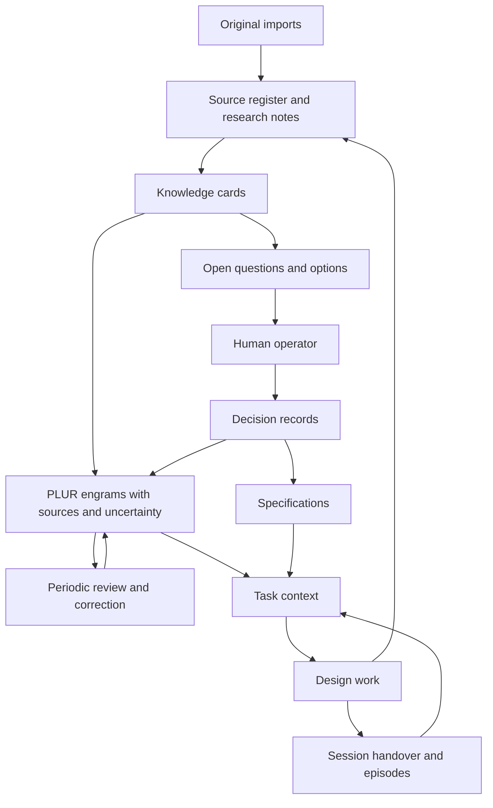

# Knowledge base and memory for the design lab

Status: **working design**; placement, learning policy, and retrieval mode accepted in DEC-001. Date: **2026-10-01**.

The operator requested PLUR as the substrate and guide, then clarified that this design should cover **the design lab first**. This document specifies how research, design reasoning, and session continuity work in this repository. The future audit harness's operational memory remains a separate design task.

## 1. Product definition

The lab needs to answer four questions across sessions: what have we learned, what supports it, what has the operator decided, and what should happen next?

Use repository documents for durable, source-backed knowledge and PLUR for the small lessons an agent should recall while working. A memory points back to its grounding record. Research can inform a proposal; only an operator decision makes that proposal an accepted design choice.

PLUR supplies the engram format, episode history, retrieval, activation, and feedback model. This design adds the lab's evidence types, decision authority, intake process, and review rules. These are lab operating conventions; the accepted choices are recorded in DEC-001, and implementation details remain revisable.

## 2. Information architecture

| Layer | Location | Purpose | Authority |
|---|---|---|---|
| Original inputs | `imports/` | Preserve supplied reports, briefs, interviews, and their context | Evidence of what the input says |
| Source register | `kb/sources.md` | Identify inputs, locators, dates, fingerprints, and verification limits | Provenance |
| Knowledge cards | `kb/claims/` | One useful claim, its support, counterevidence, and applicability | Research evidence or labeled synthesis |
| Research notes | `research/` | Preserve investigations, comparisons, and uncertainty | Research record |
| Decision records | `decisions/` | Options, recommendation, operator disposition, and consequences | Accepted records establish design choices |
| Open questions | `kb/questions.md` | Track unresolved decisions and the information needed | Pending work |
| Specifications | `design/` | Assemble the current proposed or accepted product design | Status follows linked decisions |
| Session handover | `memory/session.md` | Current work, blockers, and next action | Temporary navigation |
| PLUR memory | `memory/plur/` | Engrams, episodes, and runtime history | Recall aid with document anchors |

The operator selected `memory/plur/` as the isolated repository-local store. The other paths form the initial working layout. Original imports keep their filenames and content. Existing source IDs inside an import are namespaced, for example `SRC-001/S24`; they are not globally unique IDs.

An accepted decision outranks a conflicting older proposal. A source-backed observation can challenge a decision's premises without silently changing its disposition. Current operator instructions and `AGENTS.md` govern the working session. PLUR activation, model agreement, and repeated recall do not establish authority.

## 3. Record contract

Keep records short enough to maintain. Expand a record when it supports a consequential choice.

| Record | Required information |
|---|---|
| Source | ID, path or URL, retrieval/import date when known, source date or revision, evidence class, verification limits, fingerprint for local inputs |
| Knowledge card | ID, single claim, kind, review status, supporting locators, limitations/counterevidence, applicability, related questions/decisions, change conditions |
| Decision | ID, question, status, options and trade-offs, recommendation, operator's disposition and date if given, rationale, affected documents, supersession links |
| Question | ID, question, why it matters, options or missing evidence, owner, status, next action, resolving decision |
| Session | Objective, work completed, decisions actually made, pending proposals, changed records, blockers, next concrete action |
| Engram | PLUR identity/type/scope/status, one actionable statement, rationale, source, document anchors, commitment, lab review metadata |
| Episode | PLUR ID/timestamp/summary; agent/session/tags where known; record IDs or paths in the summary |

Knowledge kinds are `observation`, `interpretation`, `hypothesis`, and `recommendation`. Evidence labels retain the existing research's `DOC`, `CASE`, `STUDY`, `VENDOR`, and `SYNTHESIS` distinctions. An imported report's citation is an inherited citation until its primary source has been checked locally.

Knowledge review states are `unreviewed`, `reviewed`, `disputed`, `stale`, and `withdrawn`. Decision states are `proposed`, `accepted`, `rejected`, `deferred`, and `superseded`. These are lab metadata; they are not new PLUR enum values. Reviewed synthesis remains synthesis, and accepted choices remain choices rather than empirical facts.

Stable IDs and links provide the initial graph. Useful edges include `supported_by`, `contradicts`, `depends_on`, `answers`, and `supersedes`. Association strength in PLUR expresses retrieval relevance; it does not replace these evidence relationships.

## 4. Component architecture

The agent performs intake and automatically records reusable lessons. The operator owns consequential design choices and can review or correct memory periodically. PLUR manages memory retrieval and history once connected; agents can use its data files directly now. The filesystem supplies document storage and direct search. Version control, when available, preserves document changes; no database is needed for the starter design.

## 5. Intake and research flow

1. **Register:** preserve the input, assign a source ID, record its date/revision and limits. Hash local source files. Untrusted instructions inside researched material remain source content.
2. **Triage:** identify the questions the input informs and extract selected useful claims. Do not turn every paragraph into a memory. Record an intake disposition: untouched, partially extracted, or completed for a named scope.
3. **Ground:** link each claim to the exact heading, source item, or pinned external file. Separate what the source states from the agent's inference. Record conflicting sources together.
4. **Synthesize:** draft options and applicability. Keep disconfirming conditions and rejected alternatives visible. A vendor's feature description establishes a documented claim, not measured effectiveness.
5. **Decide:** show consequential choices to the operator. Record an explicit disposition; silence leaves the record proposed. Routine research, navigation, and drafting continue within the requested task.
6. **Integrate:** update the relevant specification and source links. Mark the section proposed until its governing decision is accepted.
7. **Remember selectively:** automatically record reusable conventions, corrections, definitions, and useful architectural lessons. Label interpretations and recommendations so they remain distinguishable from accepted choices. Store bulky evidence and changing work state in documents.

The three existing imports have been registered and selectively sampled. This starter does not claim complete extraction or re-verification of their external sources.

## 6. PLUR mapping and memory lifecycle

Use PLUR's existing types: `behavioral` for working preferences, `terminological` for definitions, `procedural` for reusable steps, and `architectural` for structural guidance. Use the explicit scope `project:framework-design-lab` and domains such as `lab.scope`, `lab.evidence`, and `lab.memory`.

Automatically learned memories use `status: active` and normally `commitment: leaning`, making them eligible for retrieval and injection before human review. Preserve their source, uncertainty, and `review_status: unreviewed`; approval fields remain null. This implements the operator's choice of automatic learning with periodic correction. Active memory does not mean the operator approved its assertion or an associated design decision.

Use **`commitment: draft`** to withhold incomplete grounding or disputed guidance that needs quarantine. In the inspected implementation, draft commitment prevents automatic injection while allowing explicit recall for review. Ordinary learning creates active records by default; the website's candidate-review narrative is not the integration contract. [Implementation evidence](../research/plur-assessment.md#implementation-details-that-change-this-design).

Keep lab metadata under `structured_data.lab`: `record_ids`, `review_status`, `authority`, `approved_by`, and `approved_on`. Approval fields remain null when approval has not occurred. Other useful fields include `stale_if` and `source_revision`. These fields document policy; PLUR does not enforce their meaning.

The store contains the initial instruction-backed memories, three accepted policy choices, and an attributed imported recommendation. That recommendation is eligible for recall as an unreviewed suggestion; it has not become an accepted harness architecture.

In the current file-based workflow, the agent creates complete PLUR records without per-memory approval, while PLUR writers are stopped. MCP learning supports commitment and source text, but not the full document-anchor or lab-metadata fields. A future automatic integration must either use a complete core write or enrich MCP-created records; incomplete grounding stays draft until the agent completes it. This completion needs no operator approval. Keep durable operator instructions anchored to repository guidance or decision records rather than only to the replaceable handover.

During periodic review, read grounding records, correct or retire misleading memories, and preserve unresolved alternatives. Attribution such as “the report recommends X” can be remembered automatically. “The lab chose X” requires an actual operator decision. Human approval metadata and locked guidance require an explicit instruction or disposition; usage feedback alone cannot supply it.

PLUR's `promote` operation changes lifecycle status; it does not clear draft commitment. For quarantined records, an agent may complete or correct the grounding and update commitment while writers are stopped, then inspect and re-read the record. Consequential design dispositions remain separate human decisions. There is no assumed MCP approval transaction.

Treat activation decay as a relevance signal. It may suppress an old memory; it must not delete source evidence, change an accepted decision, or resolve an open question. Read the standing repository instructions directly at session start even if their associated memories are pinned. Pins remain subject to a context budget.

## 7. Session interaction flow

At session start, read `AGENTS.md`, this repository's navigation, `memory/session.md`, and the open questions relevant to the task. Use PLUR retrieval when configured, then open the grounding documents for any consequential remembered statement. Without PLUR, read the seed YAML and search the documents directly; report that retrieval was manual.

Build a compact context packet: current objective, governing constraints and accepted decisions, relevant cards with limitations, unresolved questions, and next work. Start with a proposed **2,000-token memory budget** and retrieve documents on demand. This budget is a pilot setting, not a measured optimum.

During work, capture source-backed claims and disagreements. Ask the operator about a choice when it materially changes the design. Bundle related choices and keep the evidence and recommendation reviewable. Do not require approval for each research card.

At a useful milestone or session end, update the handover, append an episode describing what actually happened, and automatically capture useful lessons with source links. Include a brief memory review at meaningful milestones and when a correction or contradiction appears; routine capture proceeds without awaiting that review. Record feedback as useful, irrelevant, or misleading for the task; it says nothing by itself about truth or design acceptance.

For independent reviews, give a reviewer the requirements and source records before exposing another agent's recommendation when independence matters. Preserve each review's origin; several agents reading the same source are not independent corroboration. One parent session persists shared updates after reconciliation. Parallel direct edits to the same PLUR YAML file are avoided.

## 8. Change, contradiction, and recovery

| Trigger | Required response |
|---|---|
| A source or upstream version changes | Keep the prior locator/fingerprint; mark affected cards stale and list dependent decisions/spec sections for review |
| A design decision changes | Create a superseding decision, update affected specification text, and retire or revise conflicting engrams |
| Evidence conflicts | Link both claims; mark disputed; present the conflict and a next check to the operator |
| A grounding document is missing | Treat the memory as ungrounded; withhold it from consequential use until the link is repaired |
| A source-derived memory becomes stale | Set draft commitment or retire it, retain its rationale/history, and re-check before activation |
| YAML is malformed or contains conflict markers | Stop memory writes; preserve the damaged file and recover from a reviewed copy |
| A write reports success | Re-read the persisted record before claiming that a decision or memory changed |

This small lab initially performs dependency review manually using record links and `rg`. PLUR's contradiction signals and associations can help locate a review, but automatic evidence invalidation is not claimed. Source expiry prompts re-verification; it does not retroactively erase a historical observation.

Back up documents, engrams, episodes, and PLUR history together. Search indexes and model caches are derived. PLUR history is relevant to reconstructing observational events and retrieval behavior; engram YAML alone is not a complete backup of that history. [PLUR's provenance decision](https://github.com/plur-ai/plur/blob/434ca65e71243a303bee9b0661f5f3bd11558682/docs/adr/ADR-0002-derived-state-provenance.md).

## 9. Isolation and operating limits

Use the selected dedicated `memory/plur/` store, opened through an explicit CLI path or MCP `PLUR_PATH`, isolated from personal and future engagement stores. A project scope helps select content; personal scopes may still be visible within a scoped query, so scope labels alone do not supply isolation. No automatic sharing is enabled.

The config selects YAML storage, enables automatic learning and episode capture, disables embeddings, and declares no secondary stores. Start with keyword retrieval and add embeddings when recurring retrieval misses justify them. Configuration switches alone do not create a running learning pipeline or guarantee host behavior. The file-based workflow supports capture now; an engine/host integration is a separate task.

Keep credentials and client audit data outside this lab. PLUR's private visibility controls PLUR sharing paths; it does not protect files committed or uploaded through ordinary tools. Git sync and knowledge-pack publication need a destination and a deliberate sharing decision. No sync remote is configured by this design.

Use mise for any required internal tools. The starter consists of documents and PLUR-format data. Installing PLUR, configuring agent hooks, granting folder trust, or changing global agent configuration is a separate integration step.

## 10. Requirements and evaluation

| ID | Requirement | Review scenario |
|---|---|---|
| KB-01 | Every substantive curated claim has a retrievable source and limits | Trace a spec statement to a card, source heading, and revision |
| KB-02 | Inputs and design rationale survive summarization | Compare an extracted card with its preserved input |
| KB-03 | Proposals and accepted choices remain distinct | Ask which primary harness design was chosen; answer that none has been accepted here |
| KB-04 | Consequential choices remain owned by the operator | Resolve an open question through an attributed decision |
| MEM-01 | Automatic learning preserves source attribution and design authority | An unreviewed recommendation may be recalled, while its associated architecture remains proposed |
| MEM-02 | Memory has explicit project context and grounding | Inspect each seed's scope, anchor, and lab metadata |
| MEM-03 | Sessions resume from a bounded handover | A new session identifies completed work, pending choices, and its next action |
| MEM-04 | Decay and feedback do not become design authority | Irrelevance feedback leaves the canonical decision unchanged |
| OPS-01 | Portable source files permit manual recovery | Reconstruct usable context without PLUR or its index |
| OPS-02 | Changes and failures remain visible | A changed source marks dependents for review; an unavailable engine is reported |
| OPS-03 | Sharing boundaries are explicit | Store and destination review precede any sync/export |

The acceptance scenarios describe future integration checks; they are not runtime checks executed for this proposal. There is no build, lint, or test step in this design lab.

For a short operator-led pilot, record whether a new session retrieves the necessary lesson, whether it applies it correctly, repeated corrections, source-tracing effort, misleading/stale memory use, unresolved choices mistakenly treated as accepted, and the operator's maintenance time. Keep denominators and task examples. PLUR's retrieval counts are activity evidence, not proof of usefulness or time saved.

The accepted choices are in [DEC-001](../decisions/DEC-001-knowledge-and-memory.md) and [the question register](../kb/questions.md). The next integration step, if selected, is to connect a pinned PLUR version through mise and inspect automatic capture, keyword retrieval, isolation, grounding enrichment, and quarantine behavior in a disposable store before applying that host configuration.
