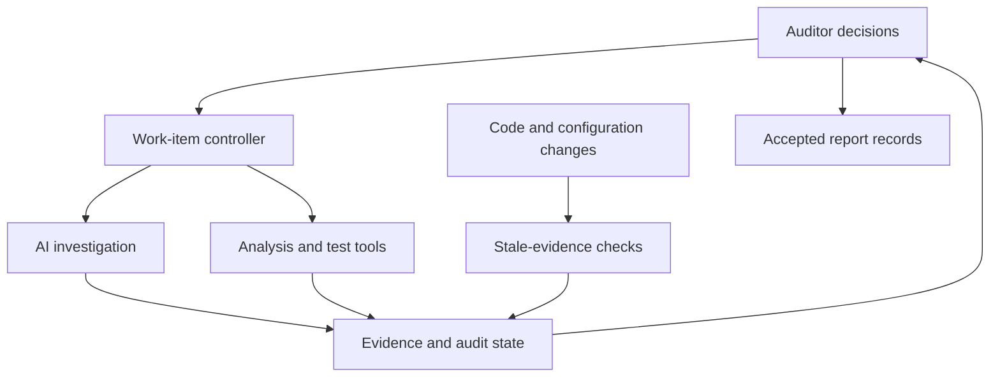
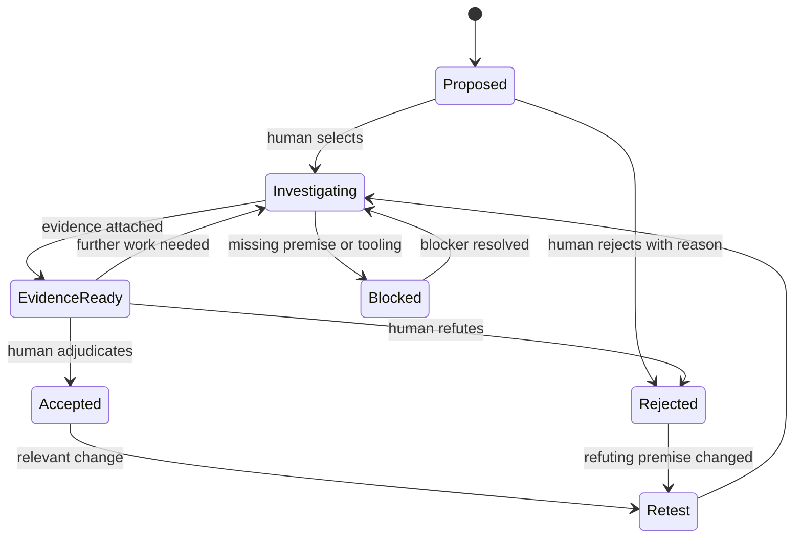

# Top three human-led smart contract audit harness designs

Date: **29 September 2026**. Version: **1.0**.

These are proposed operating systems for one auditor or a team of two to four. They are based on `01_Audit_Harness_Research_KB.md` and the reasoning in `02_Audit_Harness_Independent_Assessment.md`. They have not been implemented or benchmarked in this research.

**Recommendation:** begin with Design 1, the **Evidence Workbench**. Add Design 2, the **Property Lab**, for contracts with important accounting or mathematical guarantees. Use Design 3, the **Adversarial Scenario Room**, when composition, time, configuration, or governance dominates risk.

The names are convenient labels for proposed combinations. Hypothesis tracking, formal verification, adversarial review, and scenario testing all have substantial prior art. The intended contribution is how human authority, evidence quality, and small-team workflow fit together.

## 1. Comparative decision table

| Dimension | 1. Evidence Workbench | 2. Property Lab | 3. Adversarial Scenario Room |
|---|---|---|---|
| Primary unit | Hypothesis and its evidence | Human-approved property and its executable check | End-to-end adversarial scenario |
| Central question | What would establish or refute this suspected defect? | Does this guarantee survive meaningful state exploration? | Can permitted interactions violate the system's promise? |
| Best fit | General audits, unfamiliar repositories, solo work | Vaults, lending, AMM math, accounting, authorization state machines | Composed DeFi, bridges, settlement, upgrades, external dependencies |
| Human's main work | Interpret, prioritize, investigate, adjudicate | Specify, review assumptions, validate the oracle | Define actors and feasible conditions, challenge causal narratives |
| AI's main work | Targeted navigation, candidate development, experiment preparation | Draft handlers, properties, reference models, and counterexample explanations | Generate scenarios, identify missing premises, prepare local simulations |
| Main evidence | Source arguments and replayable witnesses | Counterexamples, mutation results, bounded/formal results | Multi-step traces with economic or availability impact |
| Solo suitability | High | Medium; depends on testing/specification skill | Medium; cap campaign breadth |
| Small-team suitability | High | High with a property reviewer | High with separate scenario and realism reviewers |
| Setup burden | Lowest | Highest | Moderate to high |
| Main failure mode | A well-organized queue of shallow questions | Proving or testing the wrong specification | Persuasive scenarios with unrealistic capabilities |
| Distinctive safeguard | Rejected hypotheses and stale evidence remain visible | Every important property gets an adequacy challenge | Scenario author and feasibility challenger start separately |
| Durable asset | Evidence and decision history | Executable specification suite | Reusable integration scenarios and dependency assumptions |

These are qualitative judgments under the assumed EVM scope. They are not scored product comparisons. The three designs can operate within one shared implementation, while remaining different methods of directing audit attention.

## 2. Shared foundation: enforced human authority

All three designs need the following foundation:

| Element | Minimum behavior |
|---|---|
| Scope manifest | Pin commit, dependency locks, compiler/settings, deployment addresses/configuration, fork chain/block if applicable, exclusions, and permitted attacker capabilities |
| Protocol model | Separate intended behavior, observed implementation, assumptions, guarantees, and unknowns |
| Evidence store | Preserve command, input/fixture, tool/model version, result, errors, code revision, and interpretation |
| Investigation controller | Enforce work-item scope, resource limits, allowed actions, and human-only state transitions |
| Local execution | Isolate untrusted code and dependency scripts; avoid production keys and live state-changing RPC access |
| Reproduction runner | Replay accepted witnesses from a clean environment without relying on the generating agent's hidden state |
| Review ledger | Name the human making scope, property, finding, severity, and remediation decisions |
| Change invalidation | Mark affected evidence and conclusions stale when code, configuration, assumptions, or relevant dependencies change |
| Export | Produce reports from accepted records and retain unresolved concerns explicitly |

The assistant can autonomously perform permitted work inside a human-approved task. It cannot expand scope, treat its own assumptions as approved facts, mark a final finding accepted, or merge a fix. The controller should enforce these limits even if the model requests otherwise.

Repository comments, README files, retrieved reports, and tool output are evidence inputs, not governing instructions. A malicious instruction in a target repository must not grant network access, expose credentials, or change approval rules. Keep provider credentials outside the execution worker where practical; restrict outbound access and local fork RPC methods; validate generated report content before export. Human review cannot compensate for secrets already exposed by an unrestricted tool run.

The underlying architecture can remain small:



This diagram is a proposed control relationship, not an existing product architecture. A task is incomplete when a tool fails or a required artifact is absent; it must never be marked clean merely because no alert was returned.

## 3. Design 1 — Evidence Workbench

### Core idea

Turn the audit into a managed series of security questions. Every question has a precise claim, explicit prerequisites, source anchors, a next experiment, and a human decision. AI helps advance the question; it does not determine the final verdict.

This is the best first design for a solo auditor because it supports ordinary manual review immediately. It does not require a complete formal specification, a large corpus, or many agents to become useful.

### Workflow

1. **Human orientation.** Read the main documentation and manually trace at least one complete asset flow. Record the initial threat model before seeing broad AI vulnerability output.
2. **Grounded system map.** Generate entry-point, role, inheritance, state-writer, and dependency inventories. The auditor corrects ambiguous relationships and approves the important guarantees.
3. **Bounded lead generation.** Select an audit unit and ask for mechanisms tied to its code and guarantees. Scanner outputs, manual notes, and historical analogies enter the same candidate queue.
4. **Triage into investigable claims.** Merge duplicate causes and reject unsupported allegations. Each surviving claim needs a plausible attacker, reachable preconditions, and a proposed decisive check.
5. **Investigate.** Permit source queries, local tests, targeted fuzzing, and evidence collection within the approved task. The assistant returns support, refutation, or a clearly bounded unknown.
6. **Adjudicate.** The human checks realism, impact, and evidence sufficiency. Important accepted findings are independently replayed; difficult unproven concerns remain visible.
7. **Retest changes.** Invalidate affected conclusions, rerun relevant witnesses, and review the fix's surrounding behavior.

### Candidate state machine



“EvidenceReady” is an administrative state, not a declaration that the finding is valid. Add deferred and disputed statuses in an implementation where they help; their records must not disappear from closure review.

### Minimum work-item schema

```yaml
id: HYP-017
audit_unit: withdrawal_flow
claim: "A precise, falsifiable statement about the suspected failure"
origin: human  # human | static_tool | ai | historical_analogy
scope_commit: "pinned repository revision"
source_anchors: []
guarantee_ids: []
attacker_capabilities: []
required_preconditions: []
supporting_evidence: []
refuting_evidence: []
next_decisive_check: null
budget:
  human_minutes: null
  tool_runtime_minutes: null
  model_cost_limit: null
status: proposed
validation:
  evidence_type: null
  replay_manifest: null
  fixture_changes_reviewed: false
  unresolved_assumptions: []
decision:
  reviewer: null
  disposition: null
  rationale: null
  severity: null
  severity_basis: null
stale_if: []
```

Use human-assessed categories such as speculative, grounded, reproduced, and independently replayed. Do not expose an LLM's invented probability as calibrated confidence.

### Illustrative investigation

**Hypothesis:** a withdrawal callback can redeem the same entitlement twice.

The assistant identifies the actual implementation, relevant callers, callback boundary, and entitlement updates. It drafts a minimal local test with a malicious receiver. The auditor checks whether the callback is available to a supported token or recipient, whether the path is permissionless, and what happens when the full transaction completes.

If nested execution eventually reverts, or total payout remains bounded by the user's actual entitlement, reject the specific claim and preserve that explanation. If a payout surplus survives the final transaction under allowed capabilities, promote the evidence for human adjudication. This example is a methodology illustration, not a claim about an actual target.

### Tools and implementation

- Existing coding-assistant interface and a small CLI/controller.
- Git plus Markdown/JSON audit records; SQLite only if query or concurrency needs justify it.
- Slither for structure and detector output; Slither-MCP where suitable.
- Foundry for tests and local execution; specialist tools selected per work item.
- Optional Solodit or internal mechanism retrieval after a local hypothesis exists.
- Report generator that consumes human-accepted records.

Hound and sc-auditor are relevant precedents for state and workflow; Trail of Bits supplies reusable review procedures. The proposed extension is enforceable human transitions, evidence invalidation, and deliberate preservation of disproofs. Source details: KB S20–S25.

### Human operating rhythm

For a solo auditor, alternate focused manual investigation with short queue review sessions. Approve small batches of assistant work, then inspect returned evidence together. Avoid supervising numerous simultaneous speculative lanes.

For two people, one owns the investigation and the other checks difficult findings and assumptions. Rotate those roles. With three or four people, assign complete guarantees or value flows, and name one integration reviewer responsible for boundaries among units.

### Failure modes and safeguards

| Failure | Safeguard |
|---|---|
| Stale or hallucinated code anchors | Resolve against the pinned revision; check snippets and symbol identity |
| Repeated variations of the same idea | Deduplicate by causal mechanism and affected guarantee |
| PoC silently modifies production logic | Keep tests separate; review diff and replay against the original target |
| AI verifier shares the proposer's mistake | Independent tool evidence and fresh human review of prerequisites |
| Promising questions vanish after timeout | Mark blocked or deferred with impact and next step |
| Record-keeping consumes the audit | Keep initial records short; expand only selected investigations |

**Success measure:** accepted unique findings and resolved high-value questions per human hour, while maintaining reproducibility and visibility of misses. An increased count of rejected low-quality candidates is not itself success.

**First prototype:** import a repository, create/edit work items, attach tool outputs, enforce human acceptance, replay one finding, and invalidate it after a relevant code change. Start with a small controller rather than a platform.

## 4. Design 2 — Property Lab

### Core idea

The auditor approves important behavioral guarantees; AI helps translate them into executable checks and meaningful state exploration. The harness also challenges whether those checks would detect a relevant error.

This design suits protocols whose risk is concentrated in accounting, asset conversion, liquidation, fee calculation, permissions, or lifecycle transitions. It is strongest when the resulting property suite can be maintained after the engagement.

### Workflow

1. **Property interview.** The auditor and protocol owner clarify expected behavior. Distinguish guarantees from implementation convenience and aspirational documentation.
2. **Property card.** Specify quantification, units, preconditions, modeled environment, permitted losses/fees, rounding limits, and relevant state transitions.
3. **Human semantic approval.** Ask whether the property is true by design, sufficiently strong, and independently stated. Compare against intended behavior before encoding it.
4. **Harness drafting.** AI prepares handlers, actors, ghost state, input domains, and reference calculations. The human reviews the action universe and fixture assumptions.
5. **Adequacy checks.** Reach meaningful states, inspect reverts/discards, and insert targeted faults into a separate copy to test the property's sensitivity.
6. **Escalating analysis.** Begin with examples and boundary cases, then stateful fuzzing. Use symbolic or formal tools selectively where their model fits the question.
7. **Counterexample review.** Minimize failures, reproduce them, and decide whether they expose a contract defect, invalid property, or faulty harness.
8. **Retained assurance.** Deliver properties with assumptions, limits, and regression hooks. Changes to assumptions require reapproval.

### Property card

```yaml
id: PROP-008
guarantee: "No unauthorized creation of redeemable entitlement"
intended_behavior_source: "document or recorded owner clarification"
human_owner: null
quantification: "Which actors, states, and action sequences are covered"
units_and_reference_values: []
preconditions: []
environment_assumptions: []
allowed_actions: []
excluded_actions_and_reasons: []
rounding_or_error_bound: null
oracle_independence: "How expected behavior is computed independently"
reachability_witnesses: []
targeted_mutants: []
analysis:
  engine_and_version: null
  bounds_and_configuration: null
  result: not_run  # counterexample | no_violation_observed | proved_in_model | unknown
  unsupported_behavior: []
human_approval: null
```

### Example: a vault accounting campaign

Use a deliberately specified fixture: two or more actors, a supported ordinary ERC-20, no external strategy yield, documented fee behavior, and explicitly modeled donations. Do not assume those conditions describe every real vault.

Useful candidate checks include:

- An independent ledger reconciles incoming and outgoing assets, fees, and external changes with custody. It must not derive both sides from the same potentially faulty getter.
- Every redeemable claim originates from a permitted deposit, transfer, or other specified entitlement event.
- A deposit/redeem cycle at unchanged exogenous conditions cannot create unauthorized value; the reference model explicitly accounts for legitimate fees and bounded rounding.
- A user's exit remains executable in states where the specification promises it, given stated liquidity and scheduling assumptions.

The final item is a conditional progress property. Finite tests can demonstrate sampled successful exits or concrete failures; they cannot establish unbounded eventual liveness without an appropriate model and fairness assumptions.

Include dust, first/last participant, zero/max permitted inputs, share transfers, donations, fee accrual, pause transitions, and multiple action sequences when applicable. If the vault allows rebasing or transfer-fee tokens, the property and model must change accordingly.

### “Test the test” is mandatory for critical properties

For selected properties, deliberately alter a fee denominator, remove an authorization check, or change rounding direction in a disposable copy. The mutation must be relevant and reachable. Confirm that the expected check detects it for the right reason.

If the property does not fail, investigate whether the mutant is equivalent, the changed behavior is outside the claim, the state is unreachable, or the oracle is weak. Do not count noncompiling mutants as useful kills. Do not tune the property merely to memorize the mutation.

Maintain two action approaches where useful: constrained handlers for meaningful valid states and broader actions for unexpected behavior. Overly helpful handlers can accidentally enforce the very protection the contract lacks.

### Tools and architecture

Use Foundry as the default local test environment. Add Echidna or Medusa if state exploration warrants it. Halmos can answer suitable symbolic questions; Certora is an option where deeper specification work and access are justified. Gambit or small manual mutations can challenge test adequacy. A Python reference model through Wake is an alternative when it simplifies independent calculations.

The model's roles are drafting, translation, harness repair, and counterexample explanation. The execution engine supplies results; the human supplies specification meaning and adjudication. Tool capabilities and limits are documented in KB S10–S19, S35, and S43.

### Small-team staffing

For a solo auditor, restrict the first campaign to a handful of high-value properties. Do not spend most of a short review translating every function into an invariant. Use a separate deliberate pass to review specifications after writing them.

For a two-person team, assign one person to protocol interpretation/specification and the other to harness and counterexample review, then cross-check. These roles should overlap enough to expose misunderstandings rather than becoming separate silos.

### Failure modes and safeguards

| Failure | Safeguard |
|---|---|
| Property restates the implementation | Derive expectation from approved semantics and an independent model |
| All useful actions revert | Review successful action distribution and state witnesses |
| Preconditions exclude the attack | Review assumptions independently; include targeted boundary campaigns |
| Fuzzer runs without relevant progress | Inspect corpus/state coverage and action mix before buying more runtime |
| Solver returns success on a weak model | Review vacuity, bounds, external-call modeling, and unsupported paths |
| AI “fixes” a failing assertion | Preserve version history and require human approval for semantic changes |
| Mutation metrics become a vanity score | Report relevant, non-equivalent mutants and reasons for exclusions |

**Success measure:** important guarantees with reviewed specifications, adequate reachable-state evidence, and meaningful sensitivity checks; plus accepted counterexamples and useful regression assets. Property count alone is not success.

**First prototype:** choose one accounting flow, write three to five property cards, produce reviewed handlers, demonstrate meaningful execution, challenge at least one property with a relevant fault, and replay any resulting counterexample.

## 5. Design 3 — Adversarial Scenario Room

### Core idea

Organize the audit around an attacker's feasible journey through the protocol and its dependencies. An author constructs the strongest plausible failure scenario; a challenger identifies unrealistic premises; the auditor decides which disagreement deserves an experiment.

The two roles can be separate people, sequential AI tasks, or a combination. AI role separation alone is not independent review. The point is to expose disagreements and test them, with a human controlling the threat model.

### When this is the right primary method

Use it when individually reasonable components interact in ways that may violate a system promise: collateral valuation, vault integration, message settlement, liquidity access, keeper behavior, emergency operations, upgrades, or delayed withdrawals.

A contract-by-contract review still matters, but the main work unit becomes a complete flow such as “deposit collateral, borrow, change valuation, liquidate, settle.” Actors, ordering, and external conditions are part of the case.

### Workflow

1. **Select a system promise.** For example, minted claims remain backed, settlement occurs at most once, or authorized users can exit under specified conditions.
2. **Draw a boundary map.** Include contracts, roles, supported assets, oracle sources, off-chain actors, configurations, and external trust. Identify what is modeled and what is genuinely tested.
3. **Approve an attacker charter.** State capital access, callable functions, sequencing powers, governance capabilities, and unavailable privileges.
4. **Develop scenarios separately.** An author proposes a causal sequence. A challenger receives the code and charter and checks capabilities, prerequisite feasibility, economics, and compensating controls.
5. **Reconcile through questions.** The human selects a disputed premise and requests the shortest experiment that can resolve it.
6. **Replay the full sequence.** Use local tests or pinned forks; include final settlement and unwind, not just an intermediate suspicious state.
7. **Vary assumptions deliberately.** Test nearby admissible conditions, then label any additional beyond-model stress tests separately.
8. **Adjudicate and retain the campaign.** Save accepted findings, infeasible scenarios, dependency assumptions, and residual risks for subsequent changes.

### Scenario matrix

The following are campaign dimensions, not a command to exhaust their full Cartesian product:

| Dimension | Examples | Human feasibility check |
|---|---|---|
| Actor | User, liquidator, keeper, supported callback receiver, privileged role | Can this actor acquire the assumed role? |
| Time | Same transaction, adjacent blocks, stale interval, epoch boundary | Does the actual chain/keeper/oracle permit this timing? |
| Ordering | Deposit before update, callback before settlement, message retry | Is the ordering reachable rather than only possible in the fixture? |
| Asset behavior | Ordinary transfer, allowed fees/rebases, decimals, donation | Is this token behavior within supported assets or admission controls? |
| Liquidity | Shallow market, withdrawal queue, constrained exit | Is capital/market depth realistic for the claim? |
| Configuration | Fee boundary, paused state, migration, role change | Who controls configuration and what safeguards apply? |
| Dependency | Oracle delay, adapter failure, upgrade, callback | Is the external behavior guaranteed, assumed, or attacker-controlled? |

The auditor chooses a small set of combinations based on the guarantee and attack surface. Exhaustive combination is usually impractical and would produce many irrelevant cases.

### Illustrative campaign: vault shares used as collateral

**Promise:** borrowing against vault shares should not create an unbacked position through a temporary accounting distortion under the agreed token, oracle, and market assumptions.

The scenario author proposes a sequence involving obtaining shares, changing the apparent share valuation, borrowing, and unwinding. The challenger asks whether the attacker can recover the cost of the valuation change, whether the oracle incorporates that change, whether collateral factors and caps limit it, and whether settlement or liquidation eliminates the gain.

The experiment must account for all attacker-controlled addresses, capital contributions, external loans and repayment, fees, residual positions, and the protocol's economic loss. A temporary increase in one wallet's balance is insufficient evidence.

Do not grant arbitrary collateral, impersonate the governor, set an impossible oracle price, or mutate victim storage to make the claim work. Those operations can be useful for isolated stress tests, but they must be labeled as setup/model changes and cannot stand in for an attacker-reachable exploit.

This is an illustrative class of audit question, not a tested exploit or a finding against a named protocol. The final outcome may be a refutation that the attacker loses more in the manipulation than they can extract. Griefing or insolvency can still matter even when direct attacker profit is absent.

### Artifacts

Each campaign retains:

- The selected guarantee and approved attacker charter.
- A causal sequence with prerequisites for every step.
- Author and challenger positions before reconciliation.
- Experiments addressing the actual disagreement.
- Complete transaction/step traces and final balance or availability effects.
- Sensitivity to time, capital, liquidity, and configuration.
- Accepted findings, refuted scenarios, and unresolved dependency questions.

For a bridge, local multi-chain simulators or mocks establish only their modeled behavior. Finality, relayer assumptions, message ordering, and real chain execution require separate scrutiny. A single-chain fork does not validate cross-chain security.

### Tools and staffing

Use the shared evidence foundation plus Foundry/Anvil, suitable fork data, traces, and a small reference economic model. Optional analyzers identify relevant callers and state writers. Use scenario-specific fixtures instead of building a generalized “digital twin” of every protocol at the outset.

A solo auditor can run the roles sequentially and cap the number of active campaigns. A second person adds most value by reviewing feasibility and final impact without first reading the author's conclusion. Three or four people can own different guarantees with a final integration review.

Existing precedents include compositional manual review, economic-invariant grouping, and coordinated finding adjudication. See KB S01, S28, and S30. My proposed emphasis is the explicit attacker charter, preserved disagreements, and experiments designed to resolve individual causal premises.

### Failure modes and safeguards

| Failure | Safeguard |
|---|---|
| Fictional attack powers | Human-approved capability charter and setup audit |
| Intermediate anomaly mistaken for loss | Run through settlement/unwind and reconcile all affected balances |
| Overfitting to one historical fork | Explore justified parameter/time variations and document transfer limits |
| Scenario explosion | Prioritize a few guarantees and disputed premises |
| Debate never produces evidence | Timebox discussion; require an experiment or mark the question blocked |
| Shared AI narratives create false consensus | Separate initial positions, rely on tools and human checks, retain dissent |
| Nonprofitable attack dismissed too early | Evaluate theft, insolvency, lockup, unfair transfer, and griefing separately |

**Success measure:** materially important interaction risks resolved with realistic traces and clear assumptions, including scenarios convincingly refuted. A high volume of creative attack stories is not success.

**First prototype:** map one multi-contract value flow, approve a charter, create three realistic scenarios, challenge their premises, and reproduce or refute at least one complete sequence.

## 6. Shared closure rules

An audit closes through a human decision based on available evidence and scope. It does not close because an agent declares completion.

Minimum closure review:

1. Every scoped high-risk guarantee or value flow has an explicit review status and evidence or a recorded gap.
2. No accepted finding relies on an unreviewed model assumption or silently modified target.
3. Important witnesses replay; alternative evidence is explicitly justified when execution is not practical.
4. Potential high-impact concerns that remain blocked are visible in the limitations or outstanding issues.
5. Fixes are tied to revisions and reviewed for new behavior, not only against the original witness.
6. The report distinguishes reviewed source from actual deployment/configuration checks.
7. Tool failures, unsupported features, and exhausted investigation budgets are recorded.

These rules support a defensible scope-limited conclusion. They cannot establish that every vulnerability has been found.

## 7. How to evaluate the three designs fairly

### Stage 1 — Small feasibility pilot

Run a **two-week workflow pilot**, explicitly separate from a production audit commitment. The duration is my proposed evaluation timebox, not a research-derived delivery estimate.

| Period | Work | Reviewable output |
|---|---|---|
| Days 1–2 | Choose representative targets; fix scope, versions, ground truth access, and measurement rules | Evaluation manifest and task assignments |
| Days 3–4 | Trial Evidence Workbench on one small audit unit | Candidate lifecycle, evidence replay, stale-record exercise |
| Days 5–6 | Trial Property Lab on a suitable unit | Reviewed properties, reachability evidence, adequacy challenge |
| Days 7–8 | Trial Scenario Room on an integration flow | Charter, challenged scenarios, end-to-end evidence |
| Days 9–10 | Blind adjudication where possible, compare human time and gaps, revise workflow | Decision memo and prioritized improvements |

This small pilot identifies usability and integration problems. It does not establish statistical superiority or general vulnerability recall.

### Stage 2 — Comparative evaluation

Use a mix of historical cases with withheld reports, patched negative controls, carefully reviewed seeded defects, and consented private or newly written code. Separate tuning targets from evaluation targets. Historical public cases remain vulnerable to model memorization even when internet retrieval is disabled.

Include a manual-plus-standard-tools baseline. Keep scope, human time allowance, model budget, and task environment comparable. Record actual consumption rather than just limits.

Do not ask one person to audit the same target sequentially with all designs and treat the later result as an independent trial. Their memory contaminates it. For a small team, randomize matched but different units across workflows, then rotate assignments across new targets. For a solo pilot, report the comparison as exploratory and disclose order effects. Repeat enough tasks before making commercial performance claims.

Have an experienced reviewer adjudicate findings without origin labels when feasible. Ground truth remains incomplete for real code; previously unknown valid findings should be reviewed and added, not automatically classified as false positives.

### Metrics and definitions

| Metric | Definition and interpretation |
|---|---|
| Precision of surfaced claims | Accepted valid distinct candidates / all resolved distinct candidates; apply the same root-cause deduplication policy to numerator and denominator, and report unresolved candidates separately |
| Known-finding recall | Accepted matches / verified in-scope known defects; limited to the curated ground truth |
| Incremental contribution | Distinct accepted findings added beyond the comparator's set, under controlled ordering and scope |
| Human burden | Time for understanding, setup, triage, test repair, validation, reporting, and fix review, separately |
| Validation throughput | Distinct accepted findings / human hours; accompany with severity/impact and known misses |
| Reproduction reliability | Accepted executable findings that replay cleanly / accepted findings requiring executable evidence |
| Property adequacy | Relevant reachable states and checks that reject reviewed non-equivalent faults; not a universal security score |
| Coverage of audit work | Important guarantees/flows with completed evidence-backed review / agreed relevant guarantees/flows |
| Stale-evidence handling | Dependent conclusions correctly reopened after a known relevant change |
| Cost | Model, compute, paid-tool, setup, and human costs, reported separately |

Do not call `FP / (TP + FP)` a false-positive rate; it is the false discovery proportion, equal to one minus precision for resolved binary outcomes. A conventional false-positive rate needs true negatives, which an open-ended candidate queue usually does not supply.

### Proposed adoption gates

Adopt a design when the pilot shows useful evidence at a tolerable human cost and no unacceptable failure of control or reproducibility. Before wider use, require:

- No accepted findings produced through unauthorized state transitions.
- Replay or explicit alternative support for every important accepted finding.
- Visibility of all blocked high-impact questions and analysis failures.
- No silent use of changed assumptions to make a test pass.
- A demonstrated ability to reopen stale conclusions after a relevant change.
- A clear explanation of what the workflow added over ordinary manual review and tools.

Choose quantitative productivity thresholds before the comparative evaluation according to the team's baseline. Do not retrofit thresholds to whichever design happens to win a small sample.

## 8. Implementation sequence I recommend

**First:** build the Evidence Workbench's small persistent state layer, clean replay path, and human decision gates. Reuse existing agent interfaces and analysis tools. This is the minimum foundation for every design.

**Second:** add Property Lab support for the protocol families the team actually audits. Curate a few strong property templates with known counterconditions and test-adequacy examples.

**Third:** add the Scenario Room as a structured mode for integration-heavy engagements. Its most valuable assets will be feasible actor models, dependency assumptions, and previously investigated causal sequences.

Only then consider multiple concurrent assistants, a graph UI, broader commercial scanner integrations, or a hosted product. The early engineering effort should make audit decisions traceable and experiments trustworthy; the evaluation should determine which additional automation earns a place.
